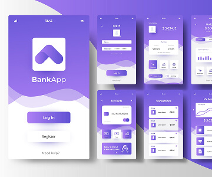
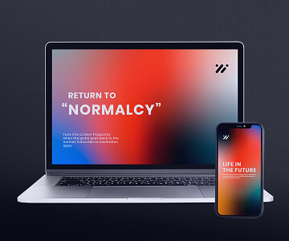
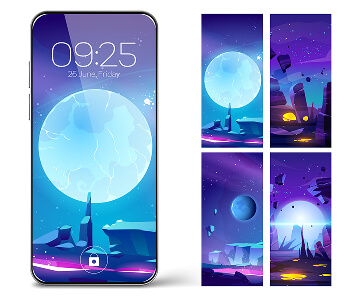

.prettierrc.json

{
	 "printWidth": 80,
	 "tabWidth": 2,
	 "useTabs": false,
	 "semi": true,
	 "singleQuote": true,
	 "trailingComma": "es5",
	 "bracketSpacing": true,
	 "jsxBracketSameLine": false,
	 "arrowParens": "avoid",
	 "proseWrap": "always"
	}

	https://validator.w3.org/nu/#textarea Перевіряємо код валідатор
	https://tinypng.com/ оптимізуймо картинки
	https://squoosh.app/ оптимізуймо картинки
	https://html.spec.whatwg.org/multipage/named-characters.html спец символи
	https://www.toptal.com/designers/htmlarrows/symbols/ спец символи
	https://docs.emmet.io/cheat-sheet/ швидкі команди Emmet
	https://caninclude.glitch.me/ вкладеність тегів
	git status - перевірити статус файлі по відношенню до віддаленого репозиторію 
	git add --all - добавити всі зміни 
	git commit -m "up" - добавити коментар до відпрацьованої частини проекту (якщо працюємо з кимось)
	git push - відправити зміни в репозиторій
	
	index.html
	styles.css
	prettier.json
	petro.png
	
	<!DOCTYPE html>
	<html lang="en">
	  <head>
		<meta charset="utf-8" />
		<meta name="description" content="Learning the basics of HTML for beginners" />
		<title>Текст, розміщений всередині тега <title>, відображається як назва вкладки браузера.</title>
	  </head>
	  <body>
		<!-- Вміст-->
	  </body>
	</html>
	name="description" Цей атрибут визначає, що тип метаінформаціїї у цьому тегу — опис вмісту сторінки.
	content="..." де значення — це короткий опис вмісту сторінки.
	Атрибути name та content йдуть у парі, як тип + значення.
	
	<!-- Заголовок, абзац, список, елементи списка -->
	<h1>Заголовок (может быть только один в коде) каждый след. h2, h3 </h1>
	
Описание, текст

	<ol>нумерований перелік переваг</ol>
	
	<ul>
		<li>
			<a href="https://rabota.ua/">Посилання 1</a>
		</li>
		<li>
			<a href="https://jobs.dou.ua/">Посилання 2</a>
		</li>
	</ul>
	
	<a href="Ссылка" target="_blank">Значение ссылки</a>
	
	<section>
	<h2>Our Team</h2>
	<ul>
	<li>
	
	<h3>Mark Guerrero</h3>
	
Product Designer

	</li>
	</ul>
	</section>
	
	<address>
	  <a href="mailto:mango@mail.pig">mango@mail.pig</a> 
	  <a href="tel:+11112223344">+1(111) 222-33-44</a> 
	  м. Київ,  
	  Бульвар Лесі Українки, буд. 26,   
	  4й поверх офіс 427
	</address>
	Контактну інформацію розбито на рядки тегом  
	
	<a
	  href="https://goo.gl/maps/qBnEfK5AingPLZgb9" 
	  target="_blank">При натисканні посилання відкривається у новій вкладці браузера
	</a>
	
	<button type="button">Open sidebar</button>
	
	<!-- Після -->
	<main>
		<h1>Dental clinic website</h1>
		
		<section>
			<h2>About</h2>
			
Вміст секції About

		</section>
		
		<section>
			<h2>Features</h2>
			
Вміст секції Features

		</section>
		
		<section>
			<h2>Team</h2>
			
Вміст секції Team

		</section>
		
		<section>
			<h2>Testimonials</h2>
			
Вміст секції Testimonials

		</section>
	</main>
	
	
	Нехай кожна іконка буде 32 пікселя за висотою та шириною. При натисканні на посилання сторінки соцмереж повинні відкриватися в новій вкладці браузера. Використовуй наступні посилання на іконки та альтернативний текст.
	<footer>
	  <ul>
		<li>
		  
		</li>
		<li>
		  
		</li>
		<li>
		  
		</li>
	  </ul>
	</footer>
	

	
<!-- #region Our portfolio -->
<section class="portfolio">
  <h2 class="portfolio-title">Our Portfolio</h2>
   <ul class="portfolio-list">
    <li class="portfolio-list-item">
      
      <h3 class="portfolio-item-title">Banking App</h3>
      
App

    </li>

    <li class="portfolio-list-item">
      
      <h3 class="portfolio-item-title">Cashless Payment</h3>
      
Marketing

    </li>

    <li class="portfolio-list-item">
      
      <h3 class="portfolio-item-title">Meditation App</h3>
      
App

    </li>

    <li class="portfolio-list-item">
      
      <h3 class="portfolio-item-title">Taxi Service</h3>
      
Marketing

    </li>

    <li class="portfolio-list-item">
      
      <h3 class="portfolio-item-title">Screen Illustrations</h3>
      
Design

    </li>

    <li class="portfolio-list-item">
      
      <h3 class="portfolio-item-title">Online Courses</h3>
      
Marketing

    </li>
  </ul>
</section>
<!-- #endregion Our Portfolio -->

css//////////////////

/* #region Our portfolio */

.portfolio {
}
.portfolio-title {
  font-family: "Roboto", sans-serif;
font-weight: 700;
font-size: 36px;
line-height: 1.11111;
letter-spacing: 0.02em;
text-align: center;
color: #2e2f42;
}
.portfolio-list {
}
.portfolio-list-item {
  background-color: #FFFFFF
}
.portfolio-item-title {
  font-family: "Roboto", sans-serif;
font-weight: 500;
font-size: 20px;
line-height: 1.2;
letter-spacing: 0.02em;
color: #2e2f42;
}
.portfolio-item-text {
  font-family: "Roboto", sans-serif;
font-weight: 400;
font-size: 16px;
line-height: 1.5;
letter-spacing: 0.02em;
color: #434455;
}

font-family: "Roboto", sans-serif;
font-weight: 700;
font-size: 36px;
line-height: 1.11111;
letter-spacing: 0.02em;
text-align: center;
color: #2e2f42;

/* #endregion Our portfolio */
